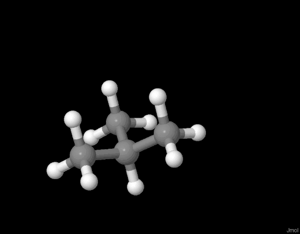

MolecularDynamics
=================

Very simple molecular dynamics model. Currently attempts to implement the MM3 forcefield for hydrocarbons [1]. Temperature control is implemented as a Langevin thermostat, however the units of this are currently wrong (this is very much a work in progress).

1. Allinger, N. L., Yuh, Y. H. & Lii, J. H. Molecular mechanics. The MM3 force field for hydrocarbons. 1. J Am Chem Soc 111, 8551–8566 (1989).
  

Todo
----

* Fix units and get thermal control working
* Implement TIP3P water model
* Implement the rest of the MM3 forcefield (eg for other atoms)
* Add the ability to have different models (e.g. define water and the molecule separately so bonding can be done)
* Different bond lengths for different atoms

Compilation
-----------

`gcc main.c -lm -fopenmp -o md -O3`

May be compiled with or without OpenMP support (this parallelises the atom loop).

Operation
---------

The user interface is as in `ThatPerson/Conformation`. In scripting mode (eg `./md script.r`) the following commands are implemented

* `open <filename>` Opens XYZ file `<filename>`
* `bond <bl A>` Introduced bonds between all atoms less than `<bl A>` apart (in Angstrom)
* `output <filename>` Writes XYZ file output into `<filename>`
* `model <model>` Sets up model `<model>`. Currently only `<model> = MM3` is allowed.
* `energy` Prints out the energy of the system calculated using the forcefield. 
* `minimize <dn> <dt> <steps> <outputsteps> <filename>` Runs minimization (e.g. velocity deleted each cycle, so system bond lengths and angles are relaxed) for `<steps>`, writing out the system to `<filename>` every `<outputsteps>`. Differentiation of the forcefield is done using `<dn>`, where this is a distance in Angstroms (generally ~0.01). Each step is `<dt>` picoseconds (generally 0.01).
* `heat <temperature>` Randomly assigns motion to all atoms dependent on temperature *see warning*
* `prod <dn> <dt> <temperature> <viscosity> <step> <outputstep> <filename>` Runs production MD. All inputs are as in `minimize`, except for `<temperature>` (*see warning*) and `<viscosity>` (*see warning*).

*warning*: The temperature implementation at the moment is just plain broken. The units are not consistent and I need to fix this. For now, a temperature of `0.01` and viscosity of `0.1` seem to give okay results, but I'm not sure what the units of these are.
